## Clone, Stop, and Chain your labelling Job in SageMaker Ground Truth

To get more control over your labelling job, there are 3 things that you can do on SageMaker Ground Truth.
* Clone -> Copy the configuration of previously created label job, without copying the previous labelled data.

* Chain -> Copy both the configuration of failed/stopped job, and copying the previous labelled data (assume if your annotators have labelled 30/100 data and you stop it, you can continue label it by chain the job)
    Chaining is useful when:
    1. Continue a labeling job that was manually stopped.
    2. Continue a labeling job that failed mid-job, after fixing issues.
    3. Switch to automated data labeling after manually labeling part of a job (or the other way around).
    4. Add more data objects to a completed job and start the job from there.
    5. Add another annotation to a completed job. For example, you have a collection of phrases labelled for topic, then want to run the set again, categorizing them by the topic's implied audience.

* Stop -> Stopping the running labelling job

Now, we are going to try all of this actions available on SageMaker Ground Truth. First, we are going to try to Clone the job.

1. Go to [SageMaker Console](https://ap-southeast-1.console.aws.amazon.com/sagemaker/home?region=ap-southeast-1#/landing)
2. in Ground truth menu, click `Labeling jobs`. Click your previous job on private annotators ("<yourname>-menu-job-label"). Click "Actions" and click "Clone Job"
    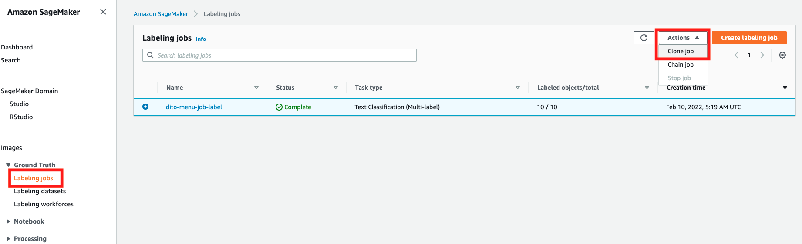

3. You will see the configuration of the labelling job that has been done. Since we want to retain it, <b>on this case, don't change anything here<b>. Feel free to change the configuration, But make sure you remember your changes.
    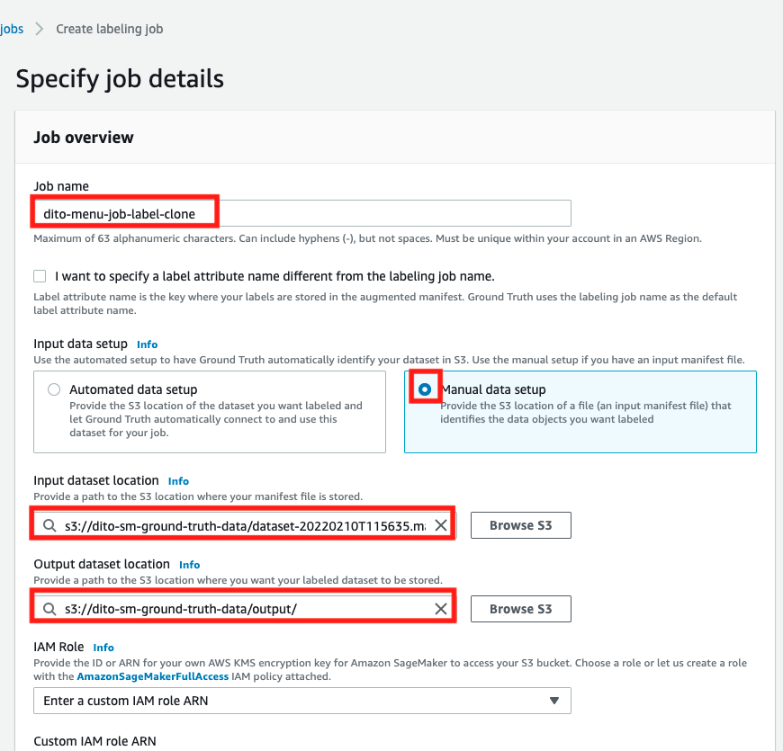

    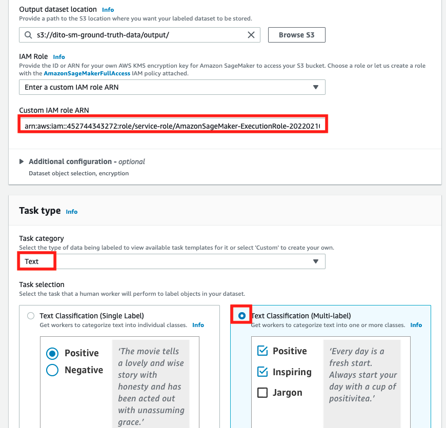

4. Scroll down and click "Next"
    

5. In Select workers and configure tool, it will also follow the same previous configuration. <b>on this case, don't change the setting as well<b>. We need to do this privately for now.
    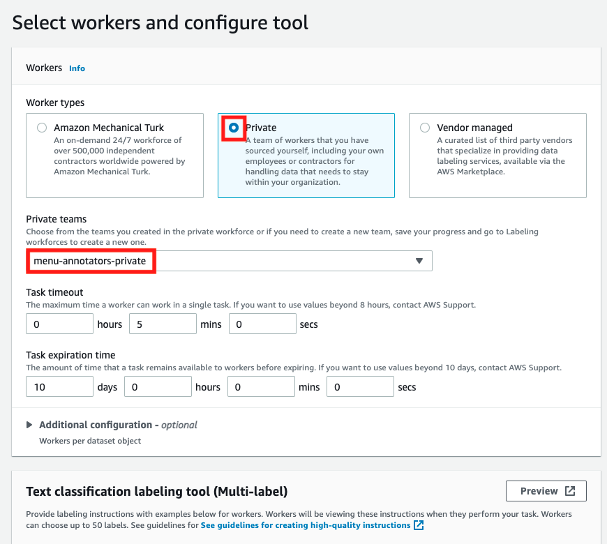

6. Same as the instructions for labeling tool, don't change it. Click "Create"
    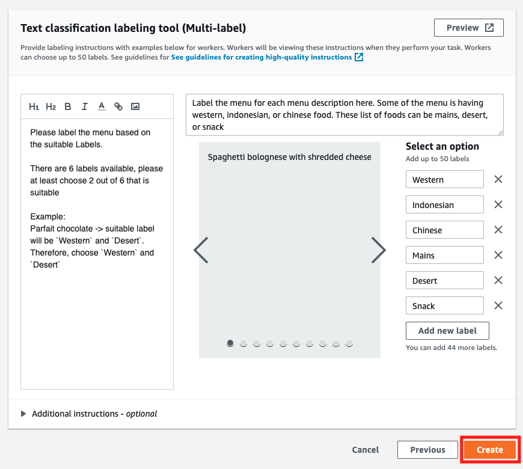

7. It will display a new job.
    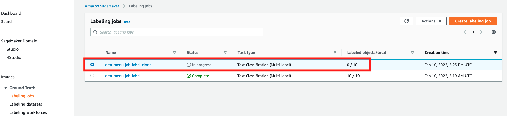

Now, let's try to label a few of our data

8. You can open the portal annotators on "labeling workforces" and click "Private" tab, or you can re-open your email and click the link.
    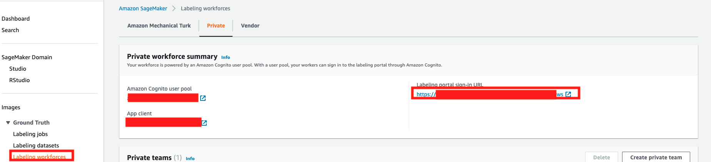

9. Fill your username and your password, just like previous step.
    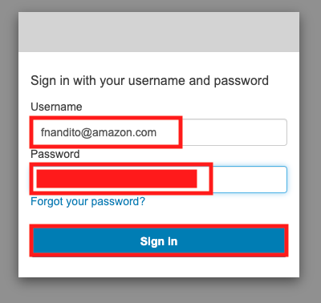

10. Choose the job, and click "Start Working"
    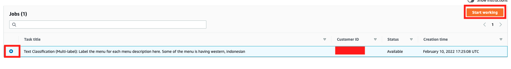

11. Try to label your data 3 times. On this case, I will pick "Western" and "Mains" and click "Submit" at below right.
    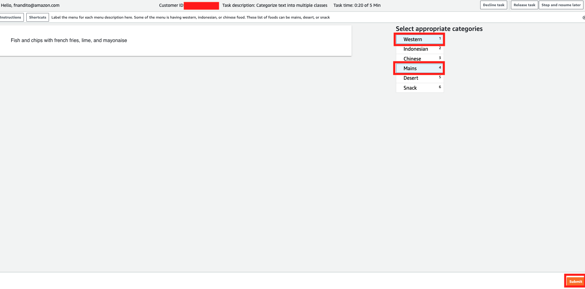

12. Once you have labelled 3 data, click "Stop and resume later" at the top right
    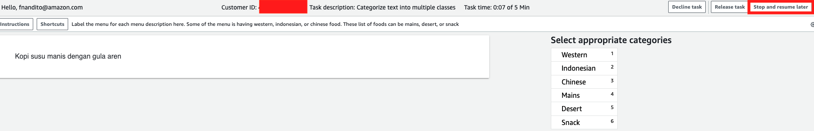

13. It will show a pop-up menu, explaining on how does stop and resume job works. Click "Continue" to proceed.
    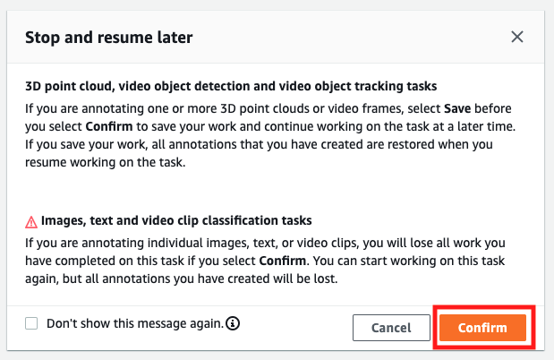

14. You might see the status for your job is changed to "Paused"
    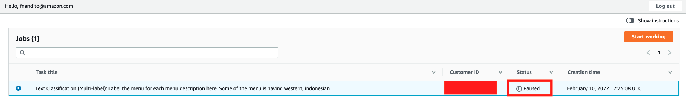

Now, we can try to stop the job in the middle of running job. We do this to chain the job later on.

15. Go to [SageMaker Console](https://ap-southeast-1.console.aws.amazon.com/sagemaker/home?region=ap-southeast-1#/landing)
16. in Ground truth menu, click `Labeling jobs`. Click your cloned job on private annotators ("<yourname>-menu-job-label-clone"). Click "Actions" and click "Stop Job"
    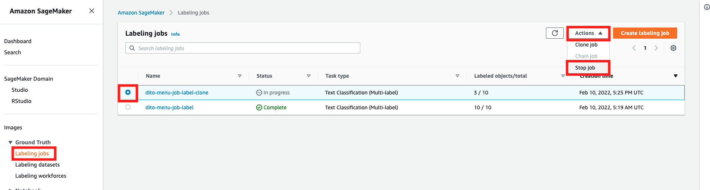

17. As you can see, the status is stopping, and the labeled data is 3 (as we have labelled 3 data in previous step)
    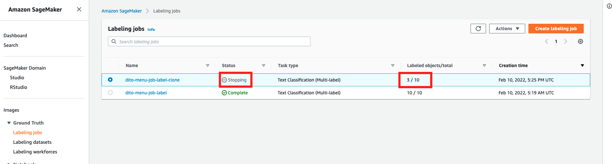

18. Once the status is stopped, choose your stopped job, and click "Action" and click "Chain Job". If you can't click it, try to refresh the page first.
    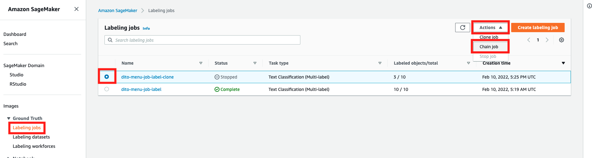

19. We are just going to change the labeling job name, but don't change any configurations inside.
    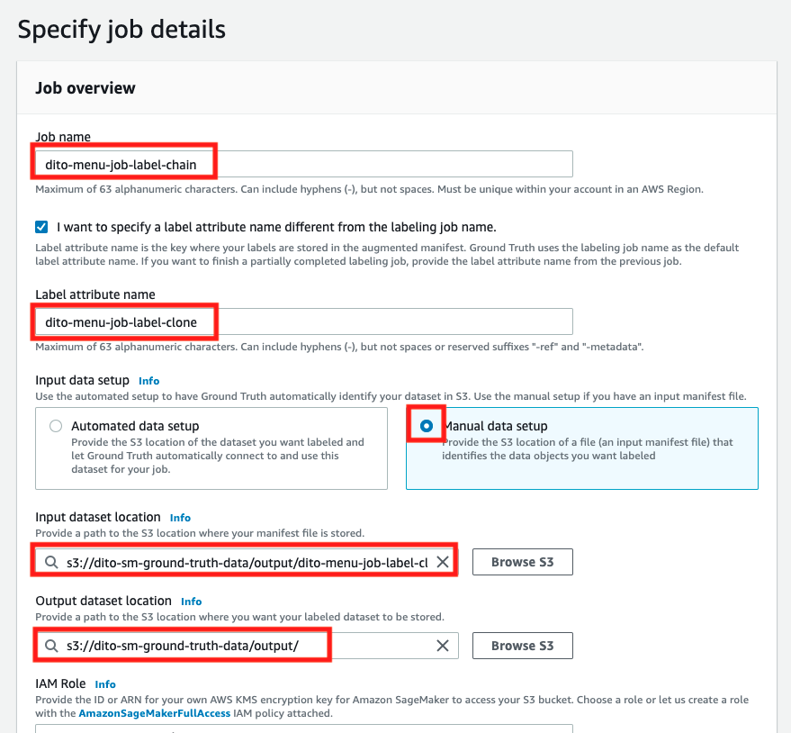

    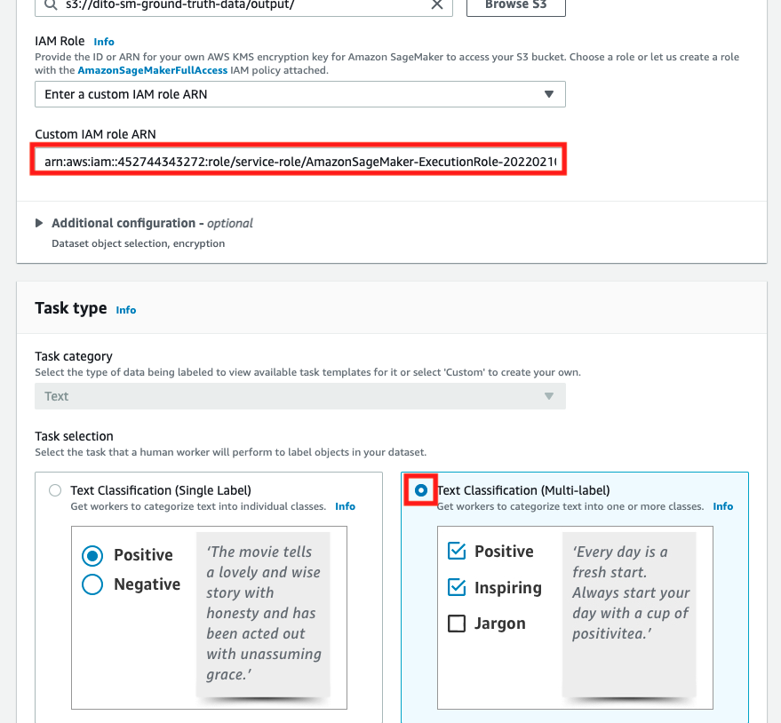

20. Scroll down, and click "Next"
    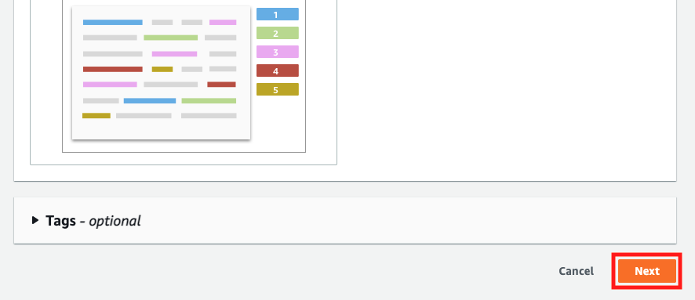

21. In Select workers and configure tool, ensure that we use the same settings to check the chained job.
    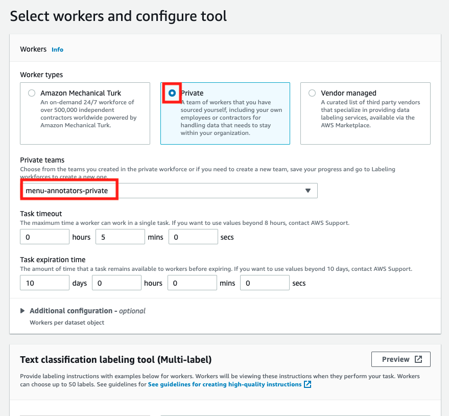

22. Scroll down and click "Create"
    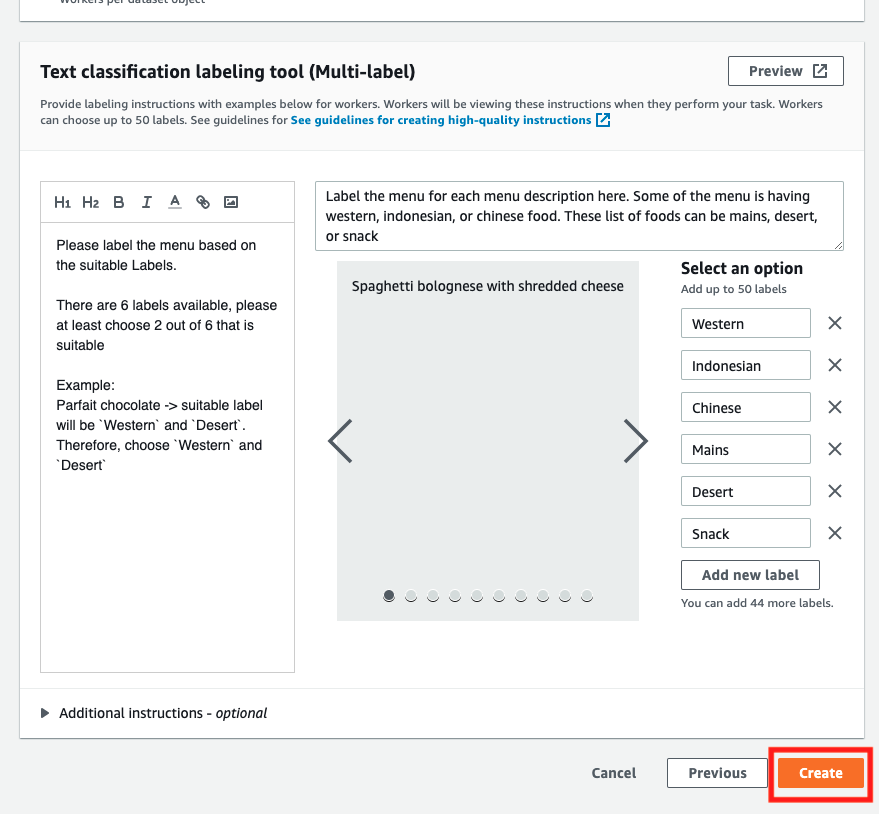

23. Once it's done, the new job will be in progress (Please ignore the "<yourname>-menu-job-label-chain" as I was stopping and re-chain it again, creating a new job called "<yourname>-menu-job-label-chain-new"). As you can see, the total labelled data is still retained (3)
    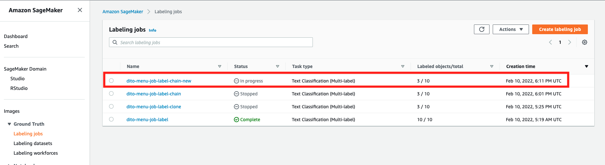

24. In your annotators portal, it will appear the same job again.
    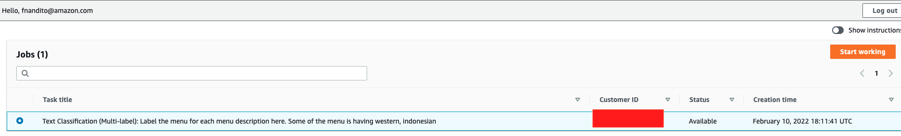

25. if you check your S3 bucket output folder, it will be separated for each labelling job, making sure that you know which job that you want to check the labelled result.
    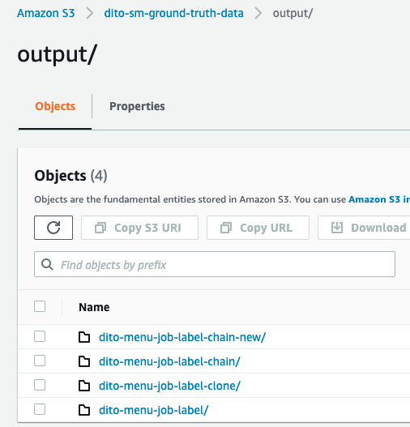

[BACK TO WORKSHOP GUIDE :house:](../README.md)

[BACK TO PREVIOUS GUIDE :arrow_left:](Mturk.md)