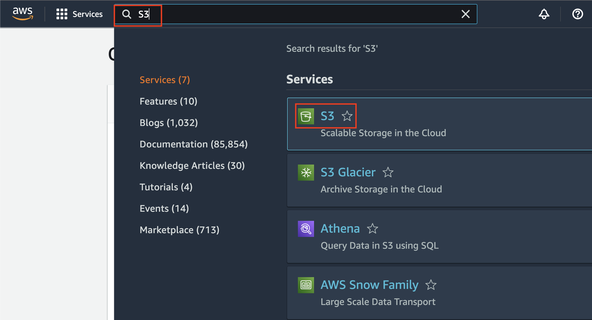

## Setup your Data using S3

First, we need to setup the data, which later to be used as an input for SageMaker Ground Truth.

1. Go to [AWS Console](https://ap-southeast-1.console.aws.amazon.com/console/home?region=ap-southeast-1#)
2. type `S3` at the search bar, and click `S3` icon
    

3. In S3 Console, click `Create bucket`
    

4. Fill the bucket name as `<yourname>-sm-ground-truth-data` and ensure the region is `ap-southeast-1`
    

5. Scroll down and click `Create bucket`
    

6. Once you create it, click the name of your bucket, and click `Upload`
    

7. Download [this example dataset](../assets/MenuData.csv) (You can right click and click `Open in a new tab`, and click `Raw`. Once the raw data is shown, choose `Save As` to download it)
8. Upload the downloaded data, by drag and drop into the S3 console, or click `Add Files` and search your downloaded file
    

9. Confirm if your data has been shown on the console, and click `Upload`
    

10. Once it's successfully completed, click `Close`
    

[BACK TO WORKSHOP GUIDE :house:](../README.md)

[CONTINUE TO NEXT GUIDE :arrow_right:](Private.md)