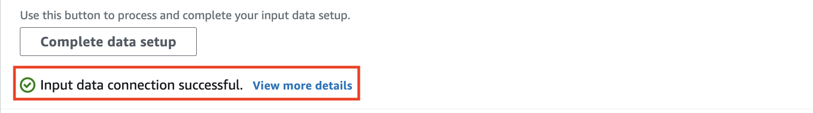

## Setup SageMaker Ground Truth for Mechanical Turk Annotators

Now, we are going to try different annotators, using mechanical turk. Mechanical turk is using 3rd party 

1. Go to [SageMaker Console](https://ap-southeast-1.console.aws.amazon.com/sagemaker/home?region=ap-southeast-1#/landing)
2. in Ground truth menu, click `Labeling jobs`. Click `Create labeling job`
    

3. In Specifying job details, fill the job name with `<yourname>-mturk-menu-job` and choose `Automated Data setup`. Click Browse S3 to choose which S3 bucket will you choose to be inputted.
    

4. Once you chose your S3 bucket (same as previous session), choose `Specify a new location` for the output. Copy your S3 bucket name, and add `/MturkOutput/` behind it (`s3://<yourname>-sm-ground-truth-data/MturkOutput/`). Choose `Text` data type, and choose existing IAM role that you have created. Click `Complete data setup`
    

5. It will display input data connection successful.
    

6. In Task type section, choose task category as `Text` and choose `Text classification (Multi-label)`
    

7. Scroll down and click `Next`
    

8. In Worker type, choose `Amazon Mechanical Turk`, and leave the task timeout and expiration time with default value. Check the `dataset does not contain adult content`, and the agreement
    
    
9. As previous step, you need to fill the description and guide for the labeller. Edit the description (top part), explanation or guidance on how to label the data (left side), and also specify how many labels availabe (right side). Once you are done, click `Create`. 
    

You can copy the decription and guide here:

description:
```
Label the menu for each menu description here. Some of the menu is having western, indonesian, or chinese food. These list of foods can be mains, desert, or snack
```


Guide:
```
Please label the menu based on the suitable Labels.

There are 6 labels available, please at least choose 2 out of 6 that is suitable

Example:
Parfait chocolate -> suitable label will be `Western` and `Desert`. Therefore, choose `Western` and `Desert`
```
 

Please wait several minutes to complete the job. Mechanical turk labellers will do the labeling process for you.

Once it's done, we can check the result by going back to the console

10. Go to Ground Truth section on SageMaker Console, and click your mechanical turk job menu
    

11. It will display the description of the job. Scroll down and check the output and click one text.
    

12. The labelled result will be displayed on the screen.
    

13. To check the output JSON, go back to your labelling jobs, and click `Output dataset location`
    

14. go to folder `/output/<yourname>-menu-job-label/annotations/consolidated-annotation/consolidation-request/iteration-1/yyyy-mm-dd.json`. Click the json and click `Download` to see the full result.
    

15. This is the example of the labelled data.
    

[BACK TO WORKSHOP GUIDE :house:](../README.md)

[CONTINUE TO NEXT GUIDE :arrow_right:](CloneChain.md)

[BACK TO PREVIOUS GUIDE :arrow_left:](Private.md)