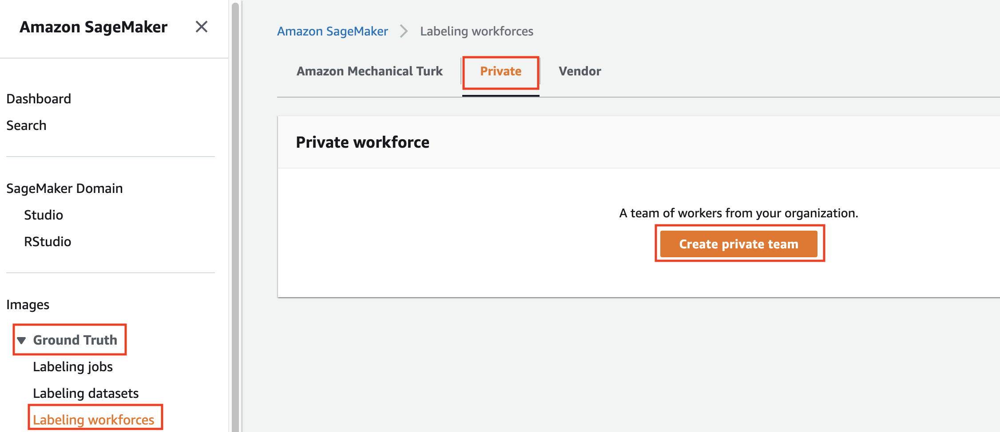

## Setup SageMaker Ground Truth for Private Annotators

Now, we are going to use the SageMaker Ground Truth to label the data. This session will tell us about how to use private annotators to label the data. This is perfect if you have your own team to be dedicated to label the data, and if you have sensitive data that you don't want to share to a lot of people.

1. Go to [AWS Console](https://ap-southeast-1.console.aws.amazon.com/console/home?region=ap-southeast-1#)
2. type `sagemaker` at the search bar, and click `sagemaker` icon
    

3. In SageMaker Console, open Ground Truth Section, and click `Labeling Workforces` and choose `Private`. After that, click `Create private team`
    

4. In Create private team page, choose `Create a private team with AWS Cognito`. This is to save who can have an access to label the data. Then, fill your team name as `menu-annotators-private`
    

5. in add workers section, choose `invite new workers by email`. Fill the email addresses, organization name, and contact email.
    

6. Scroll down and click `Create private team`
    

7. Once it's done, it will display the portal sign-in URL on SageMaker Ground Truth console.
    

8. You will receive an invitation from SageMaker Ground Truth. Open the email and you will see it just like this image below.
    

Once we have created the labeller team, now we can create the job to label the data.

9. In ground truth menu, click `Labeling jobs` and click `Create labeling job`.
    

10. In specify job details, fill the job name as `<yourname>-menu-job-label`, and choose input data setup as `Automated data setup`. Once it's done, click `Browse S3` besides S3 location input to import the data from S3.
    

11. it will show the window to choose the S3 location where we have uploaded our data. Choose your own bucket, and click `Choose`
    

12. It will be displayed on the location input. For output, choose `Specify a new location`, and copy your S3 bucket name, and add `/output/` behind it (`s3://<yourname>-sm-ground-truth-data/output/`). Choose the data type as `Text`
    

13. In IAM Role, choose `Create a new role`
    

14. For S3 bucket, choose `Any S3 Bucket`, and click `Create`
    

15. It will add the newly created IAM role. Click `Complete data setup` to process the connection between grouund truth and your S3 bucket.
    

16. Notification of input data connection successful will appear below the button.
    

17. In task type section, choose the `Text` task category, and choose `Text Classification (Multi-label)`
    

18. Scroll down and click `Next`
    

19. In Select workers and configure tool page, choose `Private` worker type, and choose your private team you have created before. Leave the task timeout and task expiration time as default value.
    

20. in text classification labeling tool, Edit the description (top part), explanation or guidance on how to label the data (left side), and also specify how many labels availabe (right side). Once you are done, click `Create`. 
    

You can copy the decription and guide here:

description:
```
Label the menu for each menu description here. Some of the menu is having western, indonesian, or chinese food. These list of foods can be mains, desert, or snack
```


Guide:
```
Please label the menu based on the suitable Labels.

There are 6 labels available, please at least choose 2 out of 6 that is suitable

Example:
Parfait chocolate -> suitable label will be `Western` and `Desert`. Therefore, choose `Western` and `Desert`
```


Now, we are going to try to sign in to the annotators portal provided by SageMaker Ground Truth.

21. Go to Ground Truth section, and click `Labelling workforces` and click `Private` tab. Click the Labeling portal sign-in URL. Or, you can also re-open your email invitation to open the link.
    

22. in the portal page, Fill the username as your email address, and password as on the email. Click `Sign In`.
    

23. You need to replace it to new password. Fill the new password and re-enter. Click `Send`
    

24. In Jobs list, click the job for text classification, and click `Start working`
    

25. Read the text, and choose the adequate label for that text.
    

26. Once you have chosen the label, click `Submit` at the bottom right page.
    

27. Repeat the process until it's all completed
28. After you complete the labeling process, it will be disappeard from the job list.
    

29. To Open the labeled result, go to [S3 console](https://s3.console.aws.amazon.com/s3/home?region=ap-southeast-1)
    

30. To see the full labelled result, go to folder `/output/<yourname>-menu-job-label/annotations/consolidated-annotation/consolidation-request/iteration-1/yyyy-mm-dd.json`. Click the json and click `Download` to see the full result.
    

31. Here's the example of the result.
    

[BACK TO WORKSHOP GUIDE :house:](../README.md)

[CONTINUE TO NEXT GUIDE :arrow_right:](Mturk.md)

[BACK TO PREVIOUS GUIDE :arrow_left:](Data.md)